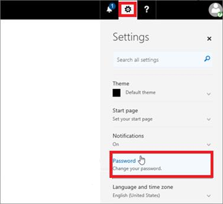

# Changing your Office365 account password

Once your account has been created/enabled for Office365 and AzureAD, you can reset your passwords through the Office Portal.

1. Navigate to https://portal.office.com and sign in with your LODS credentials if prompted

	**Note**: if this is your first sign after your account is enabled, you may be asked to provide either a phone number, email, or both for account recovery should you forget your password and need to recover your account.

1.	Once logged in, select the setting icon at the top right next to your name, scroll down and select “Change your password”.  
        
1.	In the new tab that opens, simply supply your current password and create a new password, then click Submit.